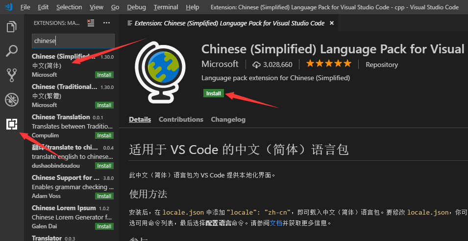
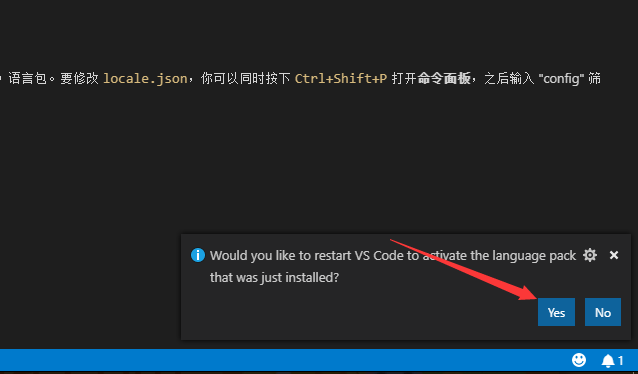
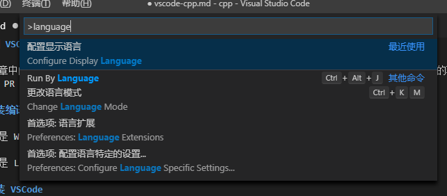
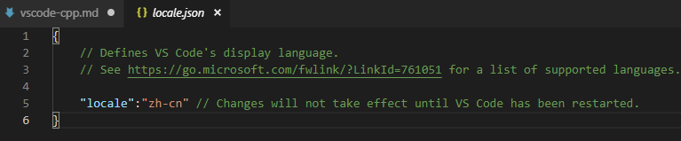
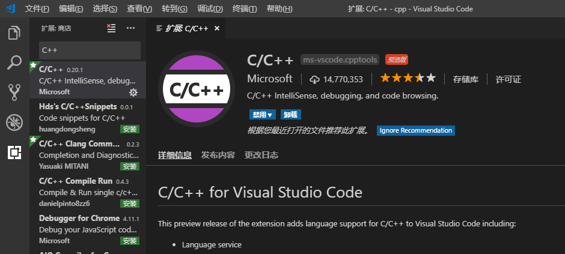
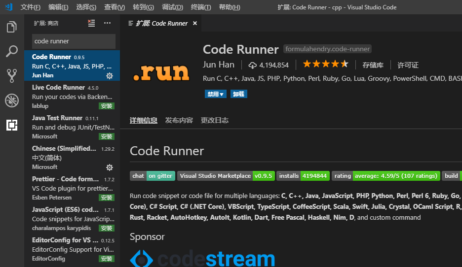
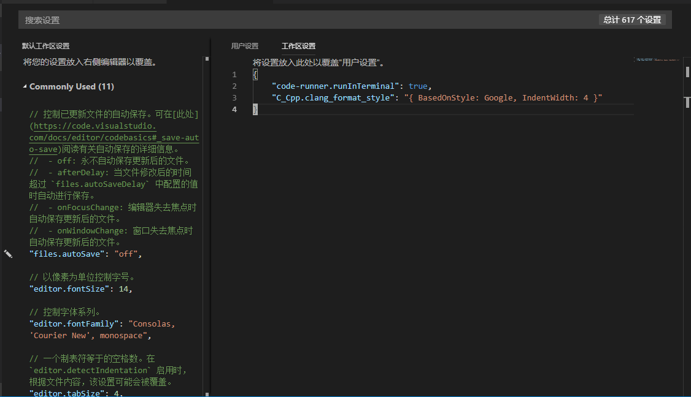

# 使用 VSCode 进行 C++ 开发

这篇文章中的内容是在 Windows 下测试通过的，理论上在其他平台也可以使用。如果您发现了在某些系统上的不兼容（或者需要注意的地方），欢迎提出 PR 来修复。

## 安装编译环境

如果你是 Windows 用户，那么你应该先安装 MinGW（参考[这里](install-cpp.md/#MinGW)）。

如果你是 Linux or Mac OS 用户，那么你可以跳过这一步。

## 安装 VSCode

没啥好说的，[官网](https://code.visualstudio.com/)下载。

## 安装中文语言包

初始的 VSCode 是英文的，需要下载中文扩展安装。



安装完成后重启 VSCode 让配置生效：



如果你错过了这个提示也没关系，你可以按 `ctrl + shift + p`（Windows），然后输入 `language` 进入语言设置，将其修改为 `zh-cn`，然后重启即可。





## 安装 C/C++ 支持

在扩展中搜索 `C++`，找到这个扩展下载。



在你的项目根目录创建一个文件夹 `.vscode`（它可能已经被自动创建了），创建文件 `launch.json` 和 `tasks.json`。分别写入内容：

**launch.json**

```json
{
    "version": "0.2.0",
    "configurations": [
        {
            "name": "C++ Launch (GDB)",
            "type": "cppdbg",
            "request": "launch",
            "targetArchitecture": "x86",
            "program": "${file}.exe",
            "miDebuggerPath": "C:\\MinGW\\bin\\gdb.exe", // 将 C:\\MinGW\\bin 修改为你的 MinGW 的路径
            "args": [],
            "stopAtEntry": false,
            "cwd": "${fileDirname}",
            "externalConsole": true,
            "preLaunchTask": "g++",
        }
    ]
}
```

**tasks.json**

```json
{
    "version": "2.0.0",
    "command": "g++",
    "args": [
        "-g",
        "${file}",
        "-o",
        "${file}.exe"
    ],
    "problemMatcher": {
        "owner": "cpp",
        "fileLocation": [
            "relative",
            "${workspaceRoot}"
        ],
        "pattern": {
            "regexp": "^(.*):(\\d+):(\\d+):\\s+(warning|error):\\s+(.*)$",
            "file": 1,
            "line": 2,
            "column": 3,
            "severity": 4,
            "message": 5
        }
    }
}
```

这时候你就可以尝试写一个程序来运行了，或者你可以使用本项目目录中的 `hello.cpp` 来进行测试。

点击 `调试-非调试启动` 或者 `ctrl + f5` 来尝试编译执行这个程序，顺利的话，你会看到一个一闪而过的黑框。

## 解决控制台闪退

在某些编辑器里，会出现运行程序后看不到结果的情况。这是因为程序运行结束后直接退出了控制台。有的博客上的解决方案是在程序末尾添加 `system("pause")` 或者 `getchar()`，在 OJ 上，如果程序中多余了这些东西的话，那是会直接错误的（超时或者编译失败）。

如果每次都要先删除代码中的一部分再提交的话，就算能记住，也很烦。幸好在 VSCode 中我们有简单的解决方案。

在扩展商店中搜索 `code runner`：



在 `.vscode` 中新建文件 `settings.json`，在工作区设置中写入如下内容：

```json
{
    "code-runner.runInTerminal": true
}
```

使用 `ctrl + alt + n` 组合键（Windows 下）或者`鼠标右键 - Run Code` 运行程序，就可以让控制台在程序结束后也不会退出，解决了控制台闪退的问题。

## 代码格式化

`鼠标右键 - 格式化文件` 或者 `alt + shift + f`（Windows）可以格式化代码，默认使用的是微软 VS 的风格。

可以切换到 Google 风格（就是我在另一个教程中推荐的风格），在 `seetings.json` 中添加 `"C_Cpp.clang_format_style": "{ BasedOnStyle: Google, IndentWidth: 4 }"`，此时 `seetings.json` 就变成了：



如果你感觉每次新建一个项目都要重新设置很麻烦的话，可以将这些设置添加到用户设置中，这样就会在每个项目中生效了。
